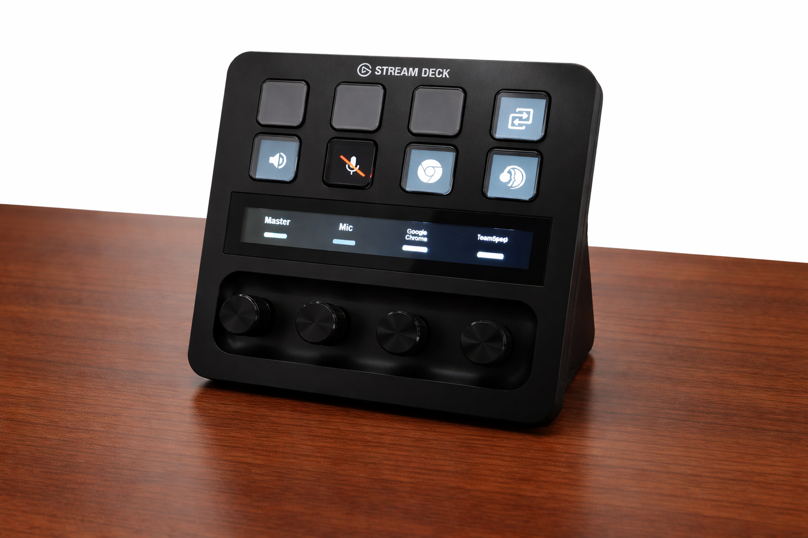

# Magic Audio Control

`magic-audio-control` is a Linux-only OpenDeck plugin written in Rust for controlling PipeWire or PulseAudio streams from an OpenDeck device.



It currently provides two actions:

- `Cycle Audio Stream` for stepping through `blank -> Master -> Mic -> active app streams -> blank`
- `Volume Control` for adjusting the currently linked target from an encoder knob

The plugin persists button and knob links in `/tmp/opendeck-audio-streams.json`, logs to `/tmp/magic-audio-control.log`, polls audio state in the background, and updates button and knob displays when streams appear, disappear, mute, or change volume.

## What It Does

When a cycle button is blank, pressing it assigns the most recent active stream and unlocks the button. A long press unlocks an assigned button so repeated presses cycle through available targets. When the button is locked, a short press toggles mute for the selected target instead.

The linked encoder action rotates to change volume and presses to mute or unmute. Targets can be the default output (`Master`), default input (`Mic`), or a specific application stream discovered through `pactl`.

## Project Layout

- `src/main.rs` starts logging, clears stale runtime registrations, starts the volume monitor, and registers both OpenDeck actions.
- `src/actions/cycle_audio_stream.rs` implements button behavior, stream assignment, mute toggling, and unlock-state oscillation.
- `src/actions/volume_control.rs` implements encoder rotation, mute toggling, button linking, and increment settings.
- `src/audio.rs` defines `AudioTarget` and the higher-level `AudioService` wrapper used by the actions and monitor.
- `src/pipewire.rs` shells out to `pactl` for stream discovery and volume or mute control.
- `src/volume_monitor.rs` runs the background poller that refreshes UI state and auto-blanks missing streams.
- `src/display.rs` and `src/icons.rs` build button and knob images, fetch Iconify icons, and apply muted styling.
- `src/shared_state.rs` and `src/state.rs` store persistent selections plus runtime lock state.
- `assets/manifest.json` defines the OpenDeck plugin manifest and action metadata.
- `assets/propertyInspector/` contains the HTML property inspectors for button linking and knob configuration.

## Requirements

- Linux
- OpenDeck with the `openaction` runtime
- `pactl`
- `gdbus`
- Network access to `https://api.iconify.design` for app icon lookup

There are no environment variables or separate config files in this repository.

## Setup Example

This plugin has two actions that work together: a **Cycle Audio Stream** button that selects which audio target to control, and a **Volume Control** encoder knob that adjusts its volume.

### Step 1 — Add a cycle button

Add a key action of type **Cycle Audio Stream** to a button in your OpenDeck layout. Open the property inspector for that button. It shows:

- **Button ID** — an auto-generated identifier (e.g. `btn-0-3`) used to link this button to a volume knob. Copy this ID.
- **Active Streams** — a live list of currently playing audio applications on your system.

### Step 2 — (Optional) Add a volume knob

Add an encoder action of type **Volume Control** next to the cycle button. Open its property inspector:

- **Linked Button** — paste the Button ID from step 1 to link the knob to that cycle button. The knob will then adjust the volume of whatever stream the cycle button is pointing at.
- **Increment** — how much to change the volume per notch, from 1–20% (default 5%).

### How it works

- A **short press** on a blank cycle button auto-assigns the most recently active stream and unlocks the button temporarily so repeated presses cycle.
- A **long press** (hold for ~1 second) unlocks an already-assigned button so you can cycle through the target list (Master → Mic → each running app → blank).
- Once the button is **locked** again, a short press toggles mute for the selected target.
- The linked **Volume Control knob** rotates to adjust volume and presses to mute/unmute. Volume updates reflect in real time as the target changes.

### Example layout

```
+------------------+------------------+
|                  |                  |
|  Cycle Audio     |  Volume Control  |
|  Stream          |  (Encoder)       |
|  (Button)        |                  |
|                  |                  |
+------------------+------------------+
```

### Clearing stale state

If buttons or knobs stop responding correctly after restarting the plugin or reconnecting the device, run this to clear stale runtime registrations:

```bash
rm /tmp/opendeck-audio-streams.json
```

Then restart the plugin.

## Build

Debug build:

```bash
cargo build
```

Release build:

```bash
cargo build --release
```

Quick compile check:

```bash
cargo check
```

Test suite:

```bash
cargo test
```

There are currently no Rust tests in the repository, so `cargo test` mainly verifies the project still compiles.

## Run

You can run the plugin binary directly during development:

```bash
cargo run
```

At runtime the binary expects to be launched by the OpenDeck action runtime, not as a standalone desktop app.

## Packaging Notes

The manifest at `assets/manifest.json` declares this Linux binary path:

```text
x86_64-unknown-linux-gnu/bin/open-deck-audio-control
```

If you package the plugin manually, the final bundle needs the compiled binary at that path alongside the `assets/` contents.

## Behavior Notes

- Cycle order is fixed to `blank -> Master -> Mic -> streams -> blank`.
- Active app streams are discovered from `pactl list sink-inputs`.
- A long press unlocks a cycle button for temporary cycling.
- Knob rotation is debounced and knob updates have a short cooldown to reduce noisy refreshes.
- App stream titles can alternate between app name and media title when metadata is available.
- Button and knob state persists in `/tmp/opendeck-audio-streams.json` across plugin restarts.

## Limitations

- Linux only; `assets/manifest.json` only declares `x86_64-unknown-linux-gnu`.
- Audio control is implemented through CLI calls to `pactl` rather than a native PipeWire client.
- Icon lookup depends on Iconify and falls back to a generic icon when no match is found.
- The property inspector UI is intentionally simple and does not add much validation.

## Development Status

`refactor-checklist.md` documents an in-progress cleanup plan for shared constants, target abstractions, state handling, display helpers, thinner action handlers, and monitor simplification.

## Built By Robots, Regrettably

Yes, this project was created with AI tools. Ewww. Specifically: OpenCode, OpenCode Manager, GLM-5, and GPT-5.4 (`xhigh`).

This README was created the same way, and yes, even the image is AI-improved too. Ewww.
